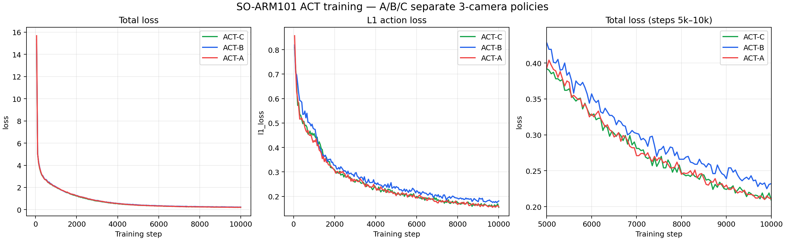

# 9주차 A — 데이터셋과 ACT 학습

## 1. 행동 데이터 수집 원칙

테스트 시 A/B/C 약통이 동시에 놓이는 조건을 반영해 대상 약뿐 아니라 방해 대상도 화면에 포함했다. 다만 한 에피소드에는 한 종류의 약통을 해당 바구니에 옮기는 작업만 기록해 목표를 명확히 했다.

- A/B/C 각각 60 에피소드
- 천장 수직, 천장 사선, 엔드이펙터의 3카메라 동시 기록
- 약통 시작 위치와 접근 방향을 변경
- 뚜껑과 몸통 파지를 섞어 기록
- 실패 에피소드는 학습 데이터에서 제외
- 한 에피소드 안에서 접근, 접촉, 파지, 이동, 놓기까지 포함

## 2. ACT A/B/C 초기 학습

각 약통을 대응 바구니로 옮기는 정책을 별도로 학습했다.

| 모델 | 작업 | STEP | 첫 loss | 최종 loss | 최저 loss |
|---|---|---:|---:|---:|---:|
| ACT-A | A 약통 → A 바구니 | 10,000 | 15.682 | 0.211 | 0.210 |
| ACT-B | B 약통 → B 바구니 | 10,000 | 15.335 | 0.232 | 0.225 |
| ACT-C | C 약통 → C 바구니 | 10,000 | 14.920 | 0.209 | 0.209 |

세 모델 모두 51,597,190개의 학습 파라미터를 사용했고 최종 체크포인트에서 NaN/Inf가 없음을 확인했다. 입력 키는 세 카메라 영상과 6축 로봇 상태로 동일하다.

## 3. W&B 기록

- [ACT-A 10K](https://wandb.ai/gyeyeongjo-chosun-university/mediflow-so101-act/runs/jcdrgxq2)
- [ACT-B 10K](https://wandb.ai/gyeyeongjo-chosun-university/mediflow-so101-act/runs/pxg9ixpi)
- [ACT-C 10K](https://wandb.ai/gyeyeongjo-chosun-university/mediflow-so101-act/runs/j4qkma86)

loss 감소와 모델 파일 정상 저장은 확인했지만, 이 결과만으로 실제 픽앤플레이스 성공률을 판단하지 않았다. 이후 감독 실험에서 ACT-C가 실패하면서 이 구분이 중요함을 확인했다.

## 4. A-v2 데이터와 100K 학습

초기 실험에서 확인된 배치 및 시작 자세 문제를 줄이기 위해 A 작업을 고정된 새 조건으로 다시 수집했다.

- 데이터셋: `Supermassive111_medicine_a_to_basket_a_3cam_v2_20261002_173846`
- 에피소드: 60개
- 프레임: 32,597개
- FPS: 30
- 카메라: 3개, 각 640×480
- 상태·행동 차원: 6
- 무결성 검사: 모든 에피소드의 첫/중간/마지막 프레임 540장 디코딩 성공

학습 설정:

| 항목 | 설정 |
|---|---|
| 정책 | ACT, ResNet-18 vision backbone |
| STEP | 100,000 |
| Batch size | 8 |
| GPU | RTX 3060 12GB |
| 체크포인트 | 5,000 STEP마다, 총 20개 |
| W&B | online 실시간 기록 |
| 학습 시간 | 12시간 00분 47초 |
| 처리량 | 약 2.31 STEP/s, 18.56 samples/s |
| 최고 GPU 메모리 기록 | 약 5.74GB |

최종 지표:

| 지표 | 값 |
|---|---:|
| total loss | 0.0514 |
| L1 action loss | 0.0505 |
| KLD loss | 0.000091 |
| grad norm | 6.108 |
| 누적 sample | 800,000 |
| 환산 epoch | 24.54 |

- [ACT-A v2 100K W&B](https://wandb.ai/gyeyeongjo-chosun-university/mediflow-so101-act/runs/5c90n0rr)

## 해석

100K까지 loss는 안정적으로 감소했고 체크포인트도 정상 생성됐다. 그러나 약 24.5 epoch만큼 같은 60개 시연을 반복해 학습했으므로 낮은 학습 loss가 일반화를 증명하지는 않는다. 다음 단계는 기록된 데이터에 대한 오프라인 action 평가와 시작 자세 검증, 짧은 감독 시험이다.
