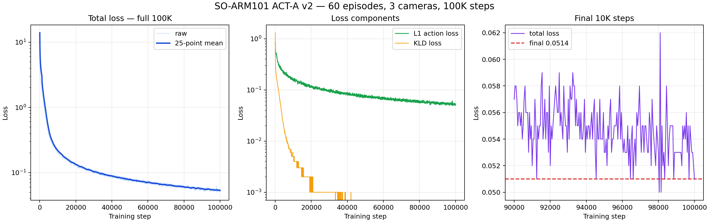

# ACT-A v2 3카메라 100K 학습 결과

학습 완료: 2026-10-03 06:25 KST

## 데이터

- 60 에피소드
- 32,597 프레임
- 30 FPS
- 3카메라: `ceiling_vertical`, `ceiling_oblique`, `end_effector`
- 모든 에피소드의 첫/중간/마지막 표본 디코딩 및 상태·행동 유한값 검사 통과

## 학습 설정

- ACT, ResNet-18 visual backbone
- RTX 3060 12GB
- 100,000 STEP
- batch size 8
- checkpoint 5,000 STEP 간격
- W&B online

## 최종 결과

| 지표 | 값 |
|---|---:|
| 학습 시간 | 12:00:47 |
| 최종 total loss | 0.0514015 |
| 최종 L1 loss | 0.0504879 |
| 최종 KLD loss | 0.0000914 |
| 최종 grad norm | 6.1077 |
| 누적 sample | 800,000 |
| samples/s | 18.556 |
| GPU memory | 5.743GB |

W&B: https://wandb.ai/gyeyeongjo-chosun-university/mediflow-so101-act/runs/5c90n0rr

## 판단

학습과 체크포인트 저장은 정상 완료됐다. 다만 최종 loss는 학습 데이터 적합도를 의미하며 실로봇 성공률을 보장하지 않는다. 오프라인 action 검증, 시작 자세 gate, 세 카메라 실시간성 확인을 통과하기 전에는 물리적 성공 모델로 간주하지 않는다.
